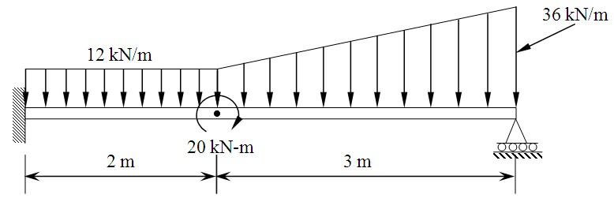
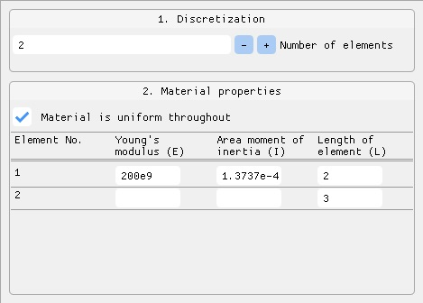
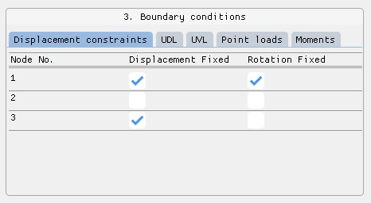
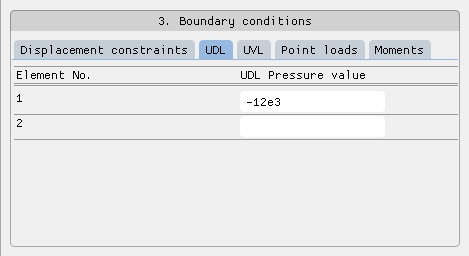
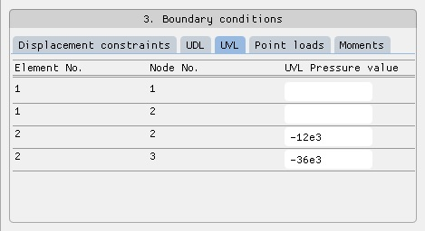
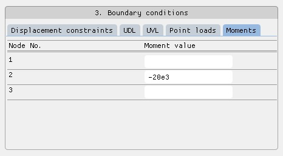
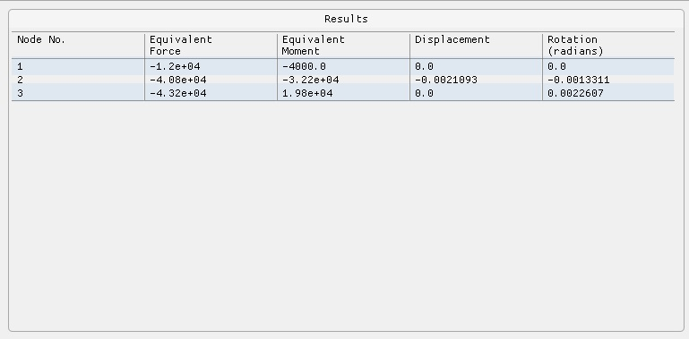
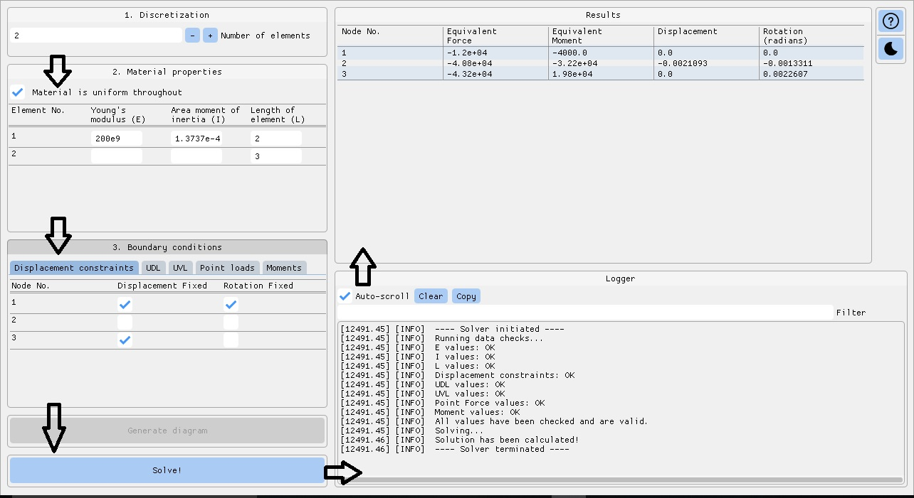

# 1 Dimensional Beam Element with 2 Degrees of Freedom FEM Solver

:warning: __*Note: Since the release of this app, Dear PyGui has been updated considerably. This app will not run in the newer versions of Dear PyGui. Please note that this app is not being maintained currently.*__

<H1>About</H1>

This solver can be used to analyse 2 degrees of freedom of 1 dimensional problems with beam elements connected in series and having 1D forces acting perpendicular to the axis of the beam. It uses the direct stiffness method and assembles the global nodal force vector, global element stiffness matrix, and the global nodal displacement vector and uses the elimination approach on the global relationship after applying all the boundary conditions provided by the user to solve for the unknown nodal displacements and slopes.


<H1>Instructions</H1>

1. Make sure you have Python 3 installed and working. 
   
2. Clone the repo:

```git clone https://github.com/RahulShagri/1D-Beam-Element-2-DOF-FEM-Solver.git```

3. Install prerequisites using pip, preferably in a new environment:

```pip install -r requirements.txt``` 

4. Run the <i>Beam_element_FEM_solver.py</i> file.

<i><b>Points to note:

1. All forces acting downwards are negative and all forces acting upwards are positive.
2. All moments acting clockwise are negative and all moments acting anti-clockwise are positive.
3. The user has to make sure the values entered have the correct units. The software does not convert any values entered. Results are obtained based on the values that are entered without converting them to different units. In the following examples, the displacements are in mm and stresses are in MPa.</b></i>


<H2>Example Problem</H2>



<H4>Step 1:</H4>

Solving for a uniform circular cross-section beam element that is divided into 2 elements with several displacement constraints, force, and pressure boundary conditions.

Known values are:
1. Number of elements = 2
2. Modulus of elasticity, E = 200 GPa
3. Diameter of the beam = 23 cm
4. Area moment of inertia, I = 1.3737 &times; 10<sup>-4</sup> m<sup>4</sup>

<H4>Step 2:</H4>

Enter the respective values of the material properties and boundary conditions.








<H4>Step 3:</H4>

Hit the solve button.

<b><i>Note: Generate Diagram feature is still under development.</i></b>

<H4>Step 4:</H4>

Ensure no errors are shown in the log window.

<H4>Step 5:</H4>

Analyse the results in the results window.

<b><i>Note: All units are in SI units in this example.</i></b>




<H2>Recommended flow of windows</H2>




<H2>Contact</H2>

You can contact me using the messaging form or the emailing option on my [engineering portfolio website](https://rahulshagri.github.io/).
